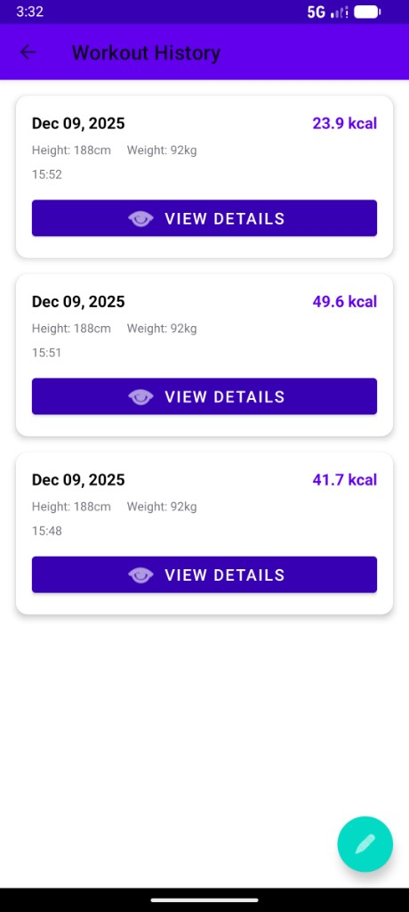
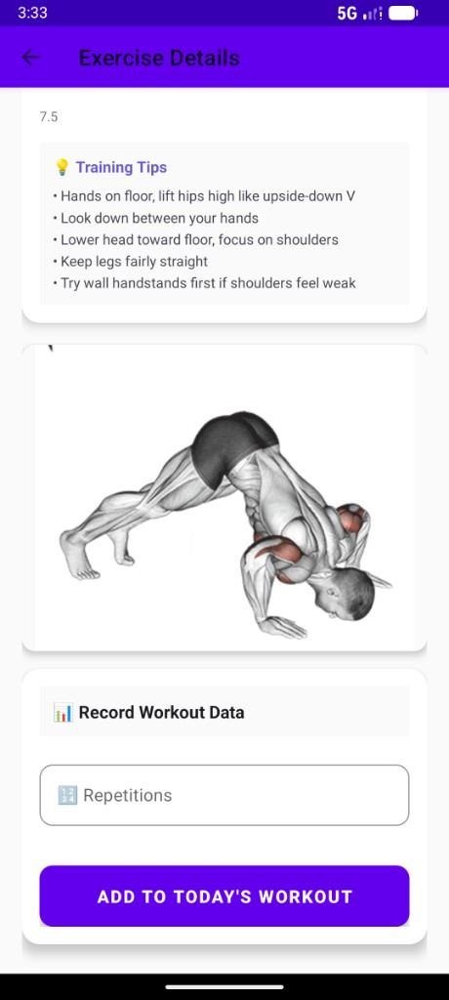
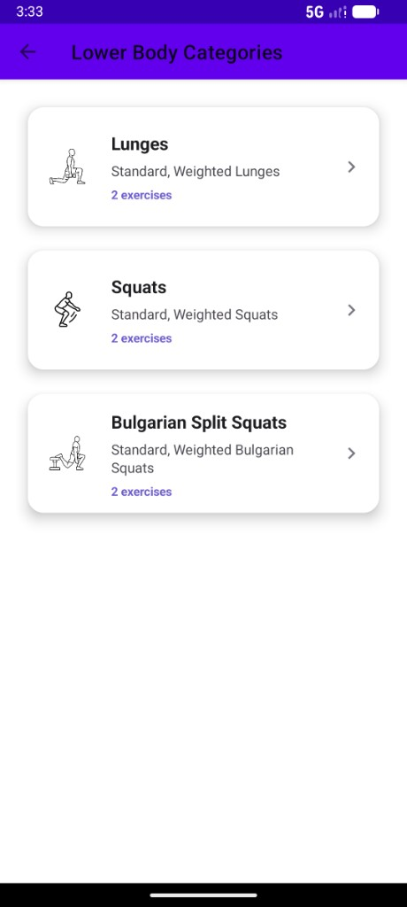

# 🏋️ SimpleFit - Fitness Workout App / 健身训练应用


---

## 🌍 Language / 语言
[English Version](#english-version) | [中文版本](#chinese-version)

---

<a name="english-version"></a>
## 🌟 Project Overview (English)

SimpleFit is an Android fitness workout app built for a CS306 final project. It lets users browse exercises by body section, view GIF demos and training tips, and track workouts with timer/counter inputs and history.

### 📸 Screenshots

| Lower body categories | Workout history | Exercise details |
| --- | --- | --- |
|  |  |  |

### ✅ Features

- **Home**: Entry cards for Upper Body / Lower Body / Core, shows height & weight, quick access to history
- **First launch**: Guided profile setup (height/weight) and persistence
- **Sub-categories**: Lists sub-categories by section (e.g., Push-ups, Squats) with exercise counts
- **Exercise list**: Shows exercise cards under the selected category
- **Exercise detail**: GIF demo, target muscles, MET, difficulty, training tips; supports counter/timer input; some exercises support assisted/added weight
- **Workout flow**: Add exercises to the current workout and view a summary (duration, calories, etc.)
- **History**: Review past workout records

### 🛠️ Tech Stack

- **Language**: Java 17
- **minSdk / targetSdk**: 24 / 34
- **Architecture**: Activities + ViewBinding, Room local database
- **Dependencies**: AndroidX AppCompat, Material, Room, RecyclerView, Glide (GIF), Gson

### 🗂️ Project Structure (Brief)

```
app/src/main/java/com/example/finalproject/
├── MainActivity.java           # Home screen
├── ProfileSetupActivity.java   # First-launch profile setup
├── SubCategoryActivity.java    # Sub-category list
├── ExerciseListActivity.java   # Exercise list
├── ExerciseDetailActivity.java # Exercise details (GIF, timer/counter)
├── WorkoutSummaryActivity.java # Workout summary
├── HistoryActivity.java        # Workout history
├── adapter/                    # RecyclerView adapters
├── data/                       # Room entities & DB (Exercise, WorkoutRecord, FitnessDatabase, FitnessDao)
└── utils/                      # Utilities (ExerciseDataLoader, UserProfileManager, WorkoutSession, JsonHelper)
```

### 🕹️ How to Run

1. Open the project root in Android Studio (the folder containing `build.gradle.kts`)
2. Wait for Gradle sync to finish
3. Run the `app` module on an emulator or device

Or build a debug APK from the command line:

```bash
./gradlew assembleDebug
```

APK output: `app/build/outputs/apk/debug/app-debug.apk`

### 📄 License

Course project for learning purposes only.

---

<a name="chinese-version"></a>
## 🌟 项目概述 (中文)

SimpleFit 是 CS306 期末项目：Android 健身训练应用。你可以按身体部位浏览运动、查看 GIF 动作演示与训练要点，并通过计时/计数输入记录训练，支持历史记录回看。

### 📸 应用截图

| 下肢分类 | 训练历史 | 动作详情 |
| --- | --- | --- |
|  |  |  |

### ✅ 功能概览

- **首页**：上肢 / 下肢 / 核心 三大入口，显示身高体重，支持进入历史记录
- **首次启动**：引导填写身高、体重并保存
- **子分类**：按部位展示子分类（如 Push-ups、Squats 等）及运动数量
- **运动列表**：展示该分类下的运动卡片
- **运动详情**：GIF 演示、目标肌肉、MET 值、难度、训练要点；支持计数器/计时器输入，部分运动支持辅助重量/负重
- **训练流程**：将运动加入当次训练，完成后查看总结（时长、卡路里等）
- **历史记录**：查看过往训练记录

### 🛠️ 技术栈

- **语言**：Java 17
- **最低 SDK**：24，**目标 SDK**：34
- **架构**：Activity + ViewBinding，Room 本地数据库
- **主要依赖**：AndroidX AppCompat、Material、Room、RecyclerView、Glide（GIF）、Gson

### 🗂️ 项目结构（简要）

```
app/src/main/java/com/example/finalproject/
├── MainActivity.java           # 主界面
├── ProfileSetupActivity.java   # 首次启动资料设置
├── SubCategoryActivity.java    # 子分类列表
├── ExerciseListActivity.java   # 运动列表
├── ExerciseDetailActivity.java # 运动详情（GIF、计时/计数）
├── WorkoutSummaryActivity.java # 训练总结
├── HistoryActivity.java        # 历史记录
├── adapter/                    # RecyclerView 适配器
├── data/                       # Room 实体与数据库（Exercise, WorkoutRecord, FitnessDatabase, FitnessDao）
└── utils/                      # 工具类（ExerciseDataLoader, UserProfileManager, WorkoutSession, JsonHelper）
```

### 🕹️ 如何运行

1. 用 Android Studio 打开项目根目录（含 `build.gradle.kts` 的目录）
2. 等待 Gradle 同步完成
3. 连接设备或启动模拟器，点击 Run 运行 `app`

或命令行构建 Debug APK：

```bash
./gradlew assembleDebug
```

APK 输出路径：`app/build/outputs/apk/debug/app-debug.apk`

### 📄 许可证

课程项目，仅供学习使用。
